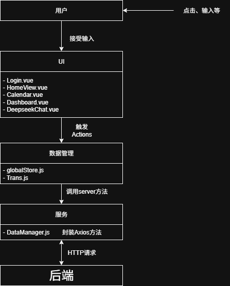

前端架构设计文档
---
1. **引言**
    * 本文档旨在描述**Timer**日程管理工具的前端部分的架构。
    * 本文档覆盖了用户界面、用户交互逻辑、API调用等内容，且**不包含**后端架构。

2. **整体架构概述**
    * 前端基于Vue.js 3开发，采用基于组件的架构模式。
    * 分层架构：
        * UI组建层：负责渲染UI、触发事件
        * 服务层：封装与后端API的通信。提供了可复用的API调用函数。
        * 数据管理层：管理用户数据，存储配置信息。
    * 架构图：
        * 

3. **技术选型**
    * **核心框架**：`Vue.js 3`
        *   *理由*：便于学习上手，且生态丰富度高，Vue3 Composition API 的灵活性也很不错。
    * **编程语言**：`JavaScript`
        *   *理由*：项目规模较小，且JavaScript较容易学习与使用，暂时无使用TypeScript的需求。
    * **路由管理**：`Vue Router`
        *   *理由*：功能完善，与Vue3框架契合的很好。
    * **UI组件库**：`Element Plus`
        *   *理由*：组件丰富，容易使用，展示效果美观。
    * **HTTP客户端**：`Axios`
        *   *理由*：Axios功能强大，容易使用，且便于修改。
    * **构建工具**：`Vite`
        *   *理由*：构建速度快，热更新体验好。
    * **包管理器**：`npm`
        *   *理由*：便于使用，社区流行度高。

4. **关键设计决策与模式**
    * **组件设计原则**：
        *   **模块化设计**：以模块为单位进行开发，提高代码复用率。
        *   **关注点分离**：各组件专注于单一功能，避免臃肿。
    * **API交互设计**：
        *   **高度封装**：单独的组件封装了与后端API交互的功能，便于前端使用，且在后端发生变动时，可以很方便的修改。
        *   **错误处理**：在Axios拦截器中处理全局错误提示，便于调试。
    * **路由设计**：
        *   **路由结构**：本项目规模较小，仅使用单一的路由实现各个页面之间的跳转。
        *   **路由元信息**：通过路由附带`meta`字段进行访问权限管理。
        *   **路由守卫**：通过查询`Cache`判断登录状态，防止未登录用户访问登录以外的界面。
    * **项目结构与组织**：
        * `/assets`：图标、CSS等。
        * `/components`：可复用组件，如展示卡片等。
        * `/router`：路由。
        * `/utils`：资源管理工具等。
        * `/views`：界面视图框架。

5. **与后端的接口定义**
    * **通信协议**：HTTP
    * **认证机制**：初定为Session Cookie，但由于技术原因，暂时只能在http请求的params中附带相关信息。
    * **接口规范**
        * **请求**
            * 日程管理：GET、POST、DELETE、PUT
            * 对话管理：GET、POST
        * **响应**
            * 日程、对话管理分别有统一的响应数据结构。
            * 暂未实现HTTP状态码处理。
    * **关键接口示例**
        *   `GET /schedule`：获取日程列表
        *   `DELETE /schedule/<id>`：删除相应日程
        *   `POST /auth/register`：用户注册

6. **部署与运维考虑**
    * **构建产物**：静态HTML、CSS、JS。
    * **托管方式**：使用Vercel进行云平台静态托管。

7. **已知限制与未来展望**
    * **安全性不足**：由于技术所限，未能通过Session Cookie实现认证机制。
    * **功能缺失**：部分用户交互功能尚未实现，比如在日历界面内展示具体日程等。
    * **移植性差**：仅实现在PC上的使用，对于移动端设备未进行适配。
    * **改进方向**：
        * 改用HTTPS，使用Cookie进行用户认证。
        * 完善日程管理功能。
        * 对于不同分辨率设备进行适配。
        * 改写为PWA，实现多端部署。