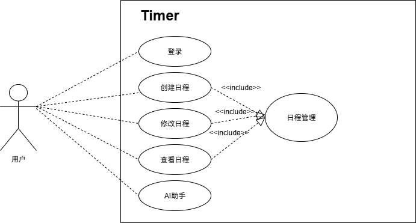
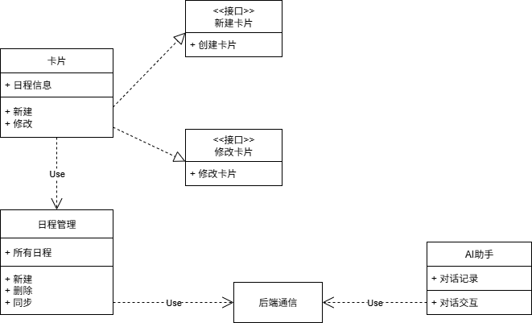
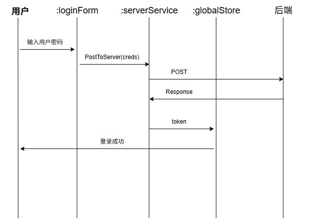
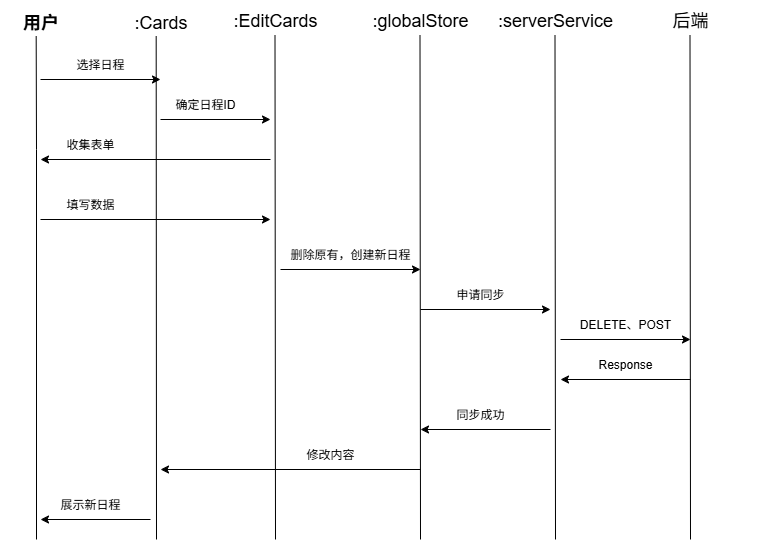
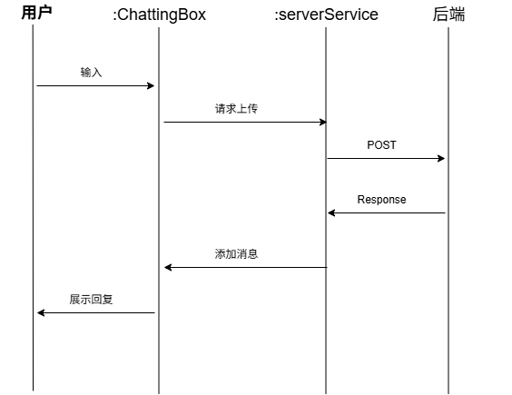

前端系统建模报告
---

1. **引言**
    * 本文档旨在使用UML等建模方法描述**Timer**前端系统的结构、行为和交互。
    * 涵盖所有前端用户界面、用户交互逻辑、状态管理、API调用逻辑。**不涵盖**后端内部逻辑。
    * 使用`draw.io`绘制。

2. **用例图**
    * 

3. **类图**
    * 

4. **序列图**
    * 登录流程图：
    * 
    * 修改日程流程图：
    * 
    * AI对话流程图：
    * 

5. **总结**
    * 建模大致描述了前端系统的结构、行为和交互。
    * 未来可以进行更细化的建模工作。