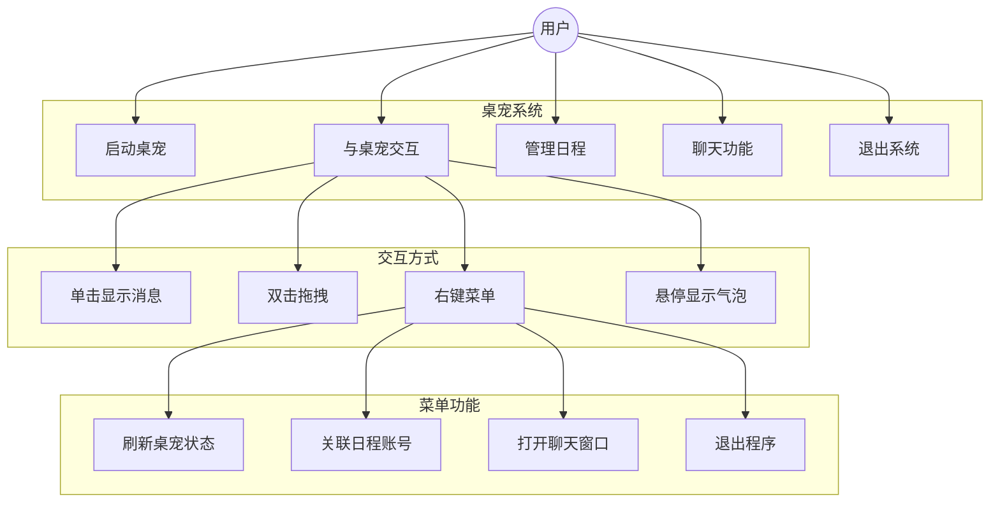
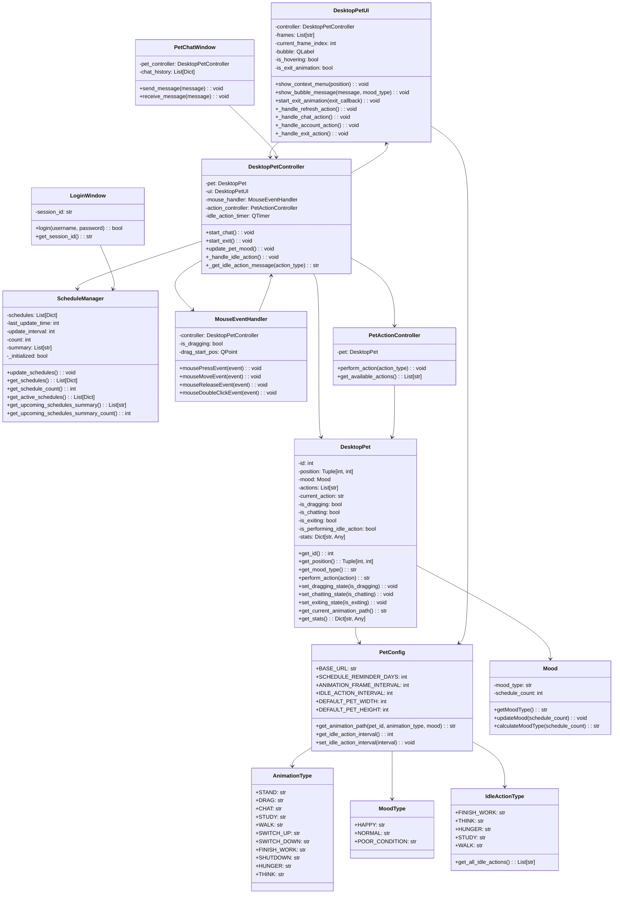
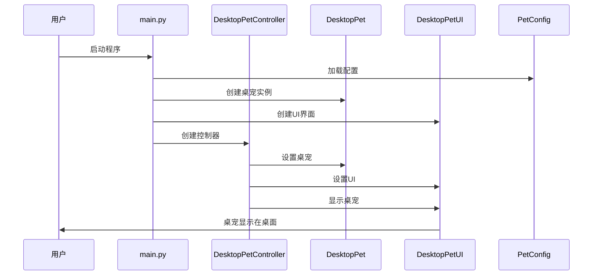
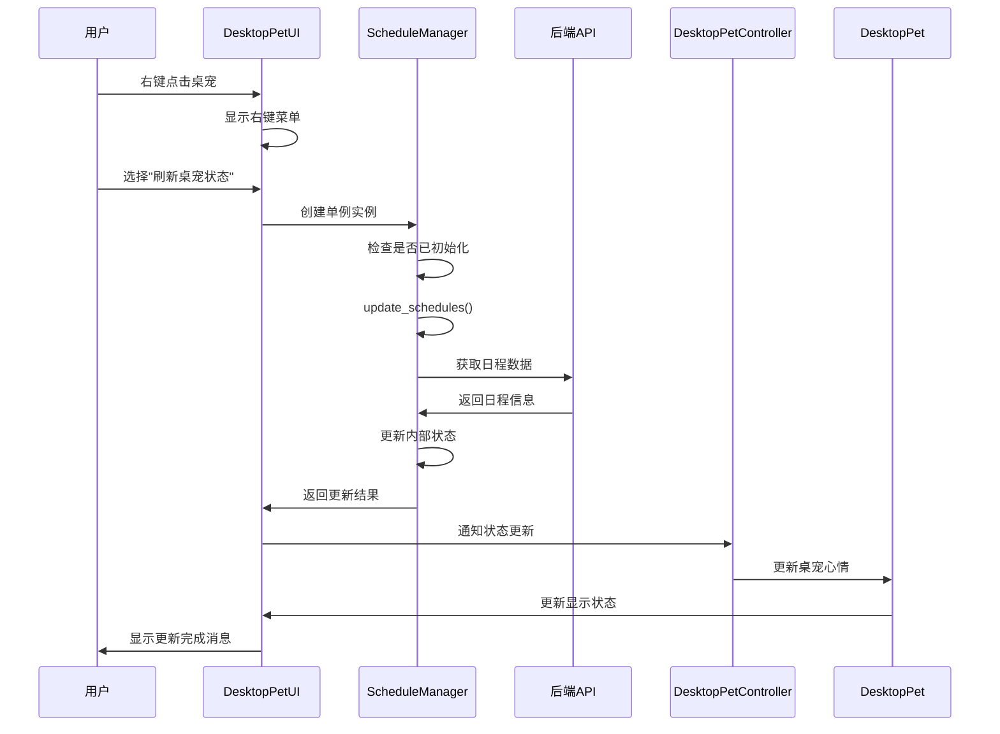
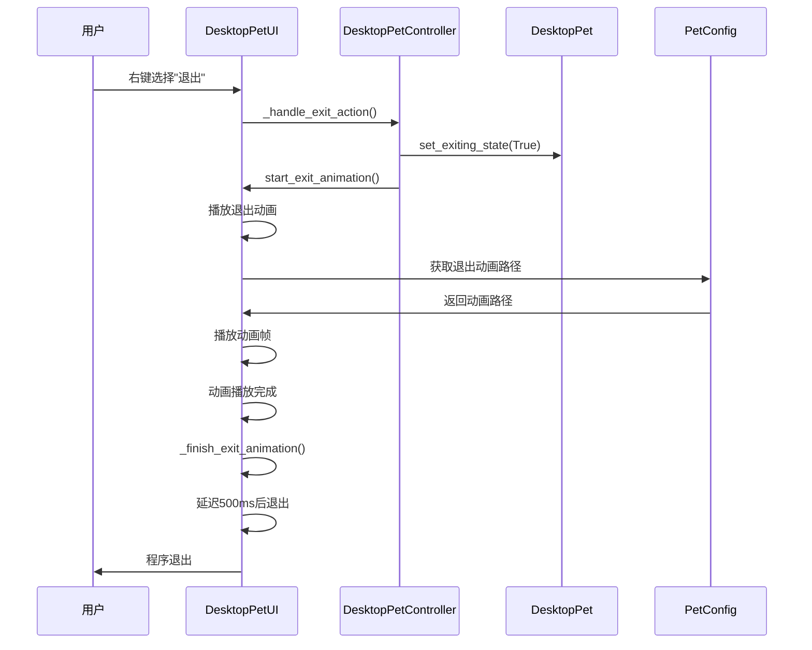
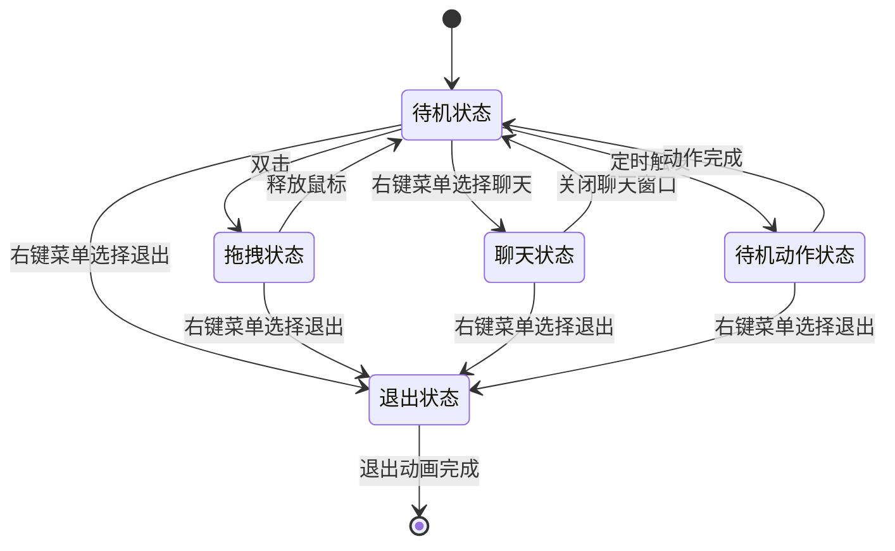
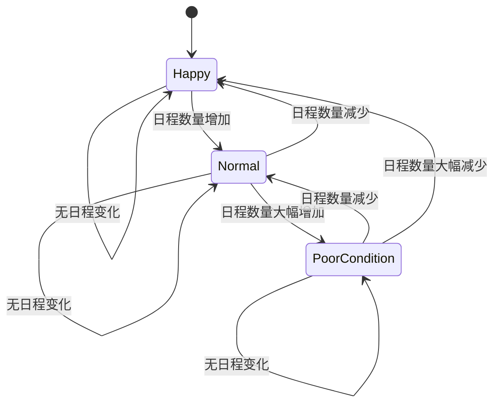
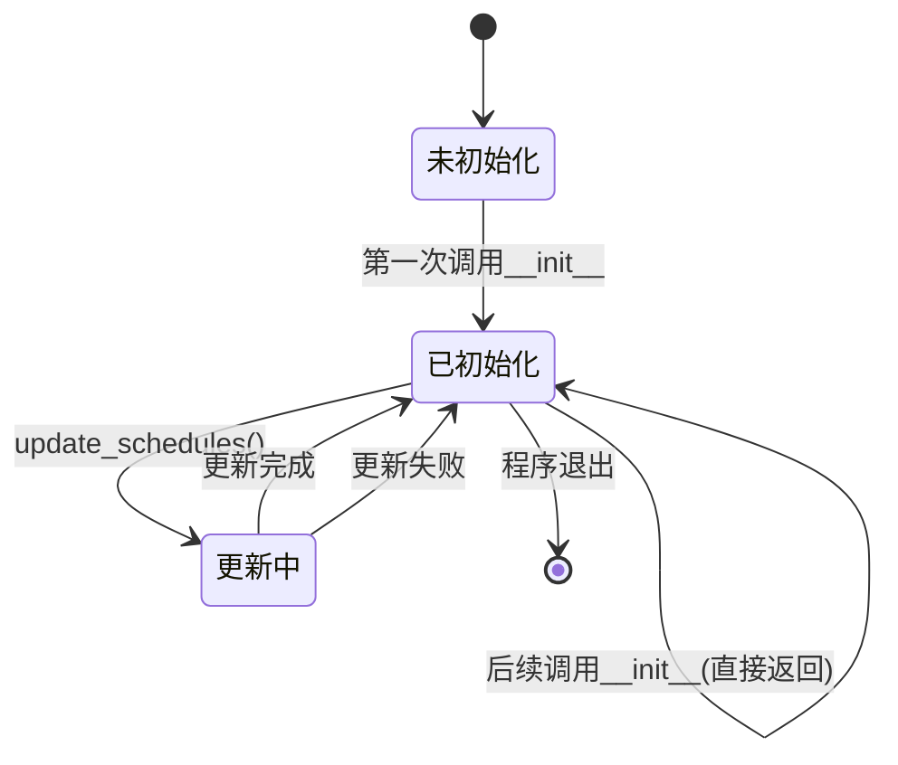

# 系统建模报告

## 前端

1. **引言**
    * 本文档旨在使用UML等建模方法描述**Timer**前端系统的结构、行为和交互。
    * 涵盖所有前端用户界面、用户交互逻辑、状态管理、API调用逻辑。**不涵盖**后端内部逻辑。
    * 使用`draw.io`绘制。
2. **用例图**
    * 
3. **类图**
    * 
4. **序列图**
    * 登录流程图：
    * 
    * 修改日程流程图：
    * 
    * AI对话流程图：
    * 

## 桌宠

### 1. 系统概述

桌宠系统是一个基于PyQt5的桌面宠物应用程序，具有智能交互、动画播放、心情管理、日程管理等功能。系统采用模块化设计，使用单例模式管理日程数据，支持多种交互方式和动画效果。

### 2. 用例图

#### 主要用例说明

1. **启动桌宠**：用户启动应用程序，桌宠显示在桌面上
2. **与桌宠交互**：用户通过鼠标与桌宠进行各种交互
3. **管理日程**：系统自动获取用户日程，桌宠根据日程调整心情
4. **聊天功能**：用户可以与桌宠进行文字聊天
5. **退出系统**：用户退出程序，桌宠播放退出动画

### 3. 类图

### 4. 序列图

#### 4.1 启动桌宠序列图

#### 4.2 刷新桌宠状态序列图

#### 4.3 退出桌宠序列图

### 5. 状态图

#### 5.1 桌宠状态图

#### 5.2 心情状态图

#### 5.3 ScheduleManager单例状态图

### 6. 系统架构特点

#### 6.1 设计模式应用

1. **单例模式**：ScheduleManager采用单例模式，确保全局唯一实例
2. **MVC模式**：Model(DesktopPet) - View(DesktopPetUI) - Controller(DesktopPetController)
3. **观察者模式**：UI组件观察桌宠状态变化并更新显示

#### 6.2 模块化设计

- **配置管理**：PetConfig统一管理所有配置
- **数据模型**：DesktopPet管理核心数据
- **UI层**：DesktopPetUI处理界面显示
- **控制层**：DesktopPetController协调各模块
- **工具类**：ScheduleManager、Mood等提供特定功能

#### 6.3 扩展性设计

- 支持添加新的动画类型
- 支持添加新的心情状态
- 支持添加新的交互方式
- 支持添加新的待机动作

### 7. 总结

桌宠系统采用现代化的软件架构设计，具有良好的模块化、可扩展性和可维护性。通过单例模式优化了资源管理，通过MVC模式实现了清晰的职责分离，通过状态图管理确保了系统状态的正确性。系统支持丰富的交互方式和动画效果，为用户提供了良好的使用体验。 

## 后端

