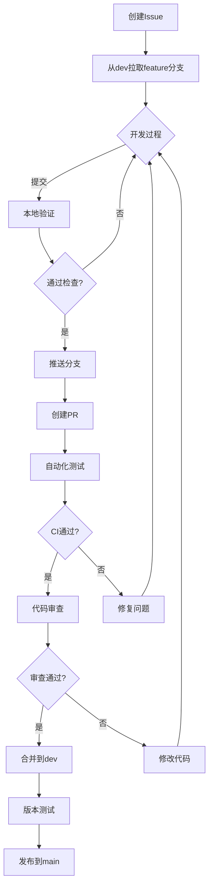

# Timer项目软件工程化实施方案

## 1. 版本控制与协作体系

### 1.1 Git 多分支工作流

+ 版本分支：

  + main: 生产版本和部署分支
  + develop: 集成测试版本
  + feat/\*: 功能开发分支，向 dev 分支合并
  + fix/\*: bug修复分支，向 dev 分支合并

+ 分支策略：

  ```mermaid
  graph LR
    A[main] -->|v1.0.0| B[dev]
    B -->|feature| C[feature/login]
    C -->|PR| B
    B -->|PR| A
    B -->|fix| D[fix/issue123]
    D -->|PR| B
  ```

### 1.2 环境管理规范

- **Python 环境**：使用 conda 管理 Python 虚拟环境，使用 requirement.txt 统一环境
- **Vue3 环境**：统一 node.js 版本，使用 `npm -i` 安装依赖

### 1.3 Pull Request 流程

PR教程可以参考仓库中文档 [PR_WorkFlow.md](PR_WorkFlow.md)

+ 创建分支：

  Contributor 拉取最新 develop 分支，并从 dev 分支创建分支

  Maintainer 直接从 develop 分支创建分支，Contributor 拉取分支并向该分支 PR，最后将该分支合并回 dev 分支（后端合作开发）

+ 提交 PR

  + 通过代码基本测试
  + 更新相关文档
  + 遵循 commit 规范

+ 由仓库管理者审查

### 1.4 文档协作规范

- 后端 API 更新同步 [Backends_API.md](Backends_API.md)
- 环境配置变更更新 [INSTALL.md](../INSTALL.md)
- 前后端以及桌宠分别维护 README.md 文档，包含开发和部署教程

### 1.5 开发流程可视化



## 2 质量保障体系

### 3.1 自动化检查表格

| 检查类型 | 工具   | 标准       | 执行时机 |
|---------|--------|-----------|----------|
| 代码风格 | flake8 |   零警告   | 提交前/CI |
| 类型检查 | mypy   | 通过率100% | 提交前/CI |
| 单元测试 | pytest | 覆盖率≥80% | CI       |

### 3.2 开发者自检清单
1. [ ] 阅读最新版开发手册
2. [ ] 同步上游dev分支
3. [ ] 运行本地测试套件
4. [ ] 检查静态分析结果
5. [ ] 更新相关文档
6. [ ] 提交规范的PR描述
