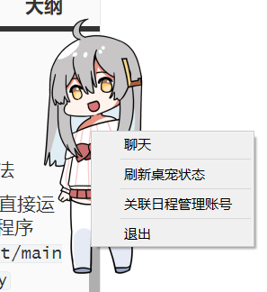
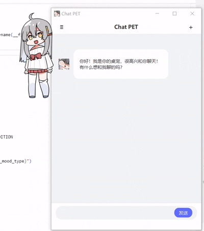

# 桌宠项目

## 项目概述

这是一个基于`PyQt5`的桌面宠物应用程序，具有智能交互、动画播放、心情管理、日程管理等功能。桌宠能够根据用户的日程安排自动调整心情，并提供丰富的交互体验。

## 使用指南

### 启动方法

##### A. 直接运行程序`pet/main.py`

##### B. 打包并启动应用（会在`pet.exe`同目录下创建文件夹`data`）

```bash
cd pet
pyinstaller main.spec
./dist/pet.exe
```

### 交互方式

1. **单击** - 出现气泡框，显示桌宠互动消息、日程提醒消息

2. **双击** - 双击桌宠，等待桌宠进入可拖拽模式（气泡框显示“抓住我吧！”）；随后拖拽即可移动桌宠位置

   

3. **右键菜单**：

   - 聊天 - 打开聊天窗口，和桌宠进行对话
     - 已上线的可以触发桌宠特殊动画的特定互动词：“陪我学习吧” “休息一下吧”
   - 刷新桌宠状态 - 手动更新日程数据
   - 关联日程管理账号 - 打开登录窗口，关联日程管理账号
   - 退出 - 播放退出动画后关闭

   

### 支持的待机动作

当前支持以下待机动作类型：

- `finish_work` - 完成工作动作

- `think` - 思考动作  

- `hunger` - 饥饿动作

- `study` - 学习动作

  

## 动画文件

 [桌宠动画文件](https://github.com/LorisYounger/VPet/tree/main/VPet-Simulator.Windows/mod/0000_core/pet/vup) 动画版权归 [虚拟主播模拟器制作组](https://www.exlb.net/VUP-Simulator)所有

详情查看 [该页面](https://github.com/LorisYounger/VPet)


## 新增功能

### 🔄 刷新桌宠状态
- 在右键菜单中新增"刷新桌宠状态"选项
- 点击后调用ScheduleManager的update_schedules()方法更新最新日程数据
- 支持手动刷新桌宠的日程状态

### 🏗️ 单例模式ScheduleManager
- ScheduleManager类采用单例模式设计
- 确保全局只有一个ScheduleManager实例
- 所有ScheduleManager对象共享相同的内部状态数据
- 提高系统性能和内存使用效率

### 🎬 退出动画
- 当用户点击右键菜单中的"退出"时，桌宠会根据当前的ID和心情状态播放对应的退出动画
- 退出动画文件路径：`static/charactor/{pet_id}/finish_work/{mood}/`
- 支持的心情类型：Happy、Normal、PoorCondition

### 🔧 代码重构亮点
- **模块化设计**：将功能拆分为独立的模块，提高代码可维护性
- **配置管理**：统一的配置文件管理所有常量和路径
- **类型注解**：添加完整的类型注解，提高代码可读性
- **错误处理**：增强的异常处理和日志输出
- **单例模式**：ScheduleManager采用单例模式，优化资源管理

## 项目结构

```
pet/
├── config.py                  # 配置管理模块
├── main.py                    # 应用程序入口
├── desktop_pet.py             # 桌宠数据模型
├── desktop_pet_ui.py          # 桌宠UI界面
├── desktop_pet_controller.py  # 桌宠控制器
├── mouse_event_handler.py     # 鼠标事件处理
├── mood.py                    # 心情管理
├── pet_action.py              # 动作管理
├── schedule_manager.py        # 日程管理（单例模式）
├── pet_chat.py                # 聊天功能
├── pet_login.py               # 登录功能
├── Bubble.py                  # 气泡消息
└── static/                    # 静态资源
    └── charactor/             # 角色动画
        └── {pet_id}/          # 桌宠ID
            ├── stand/         # 站立动画
            ├── drag/          # 拖拽动画
            ├── chat/          # 聊天动画
            ├── switch_up/     # 心情变好动画
            ├── switch_down/   # 心情变差动画
            ├── finish_work/   # 完成工作动画
            ├── shutdown/      # 退出动画
            ├── hunger/        # 饥饿动画
            ├── think/         # 思考动画
            └── study/         # 学习动画
```

## 核心模块说明

### 1. config.py - 配置管理
```python
class PetConfig:
    # 动画类型
    class AnimationType:
        STAND = "stand"
        DRAG = "drag"
        CHAT = "chat"
        STUDY = "study"
        WALK = "walk"
        SWITCH_UP = "switch_up"
        SWITCH_DOWN = "switch_down"
        FINISH_WORK = "finish_work"
        SHUTDOWN = "shutdown"
        HUNGER = "hunger"
        THINK = "think"
    
    # 心情类型
    class MoodType:
        HAPPY = "Happy"
        NORMAL = "Normal"
        POOR_CONDITION = "PoorCondition"
```

### 2. schedule_manager.py - 日程管理（单例模式）
```python
@singleton
class ScheduleManager:
    """管理日程数据的单例类"""
    
    def __init__(self, update_interval: int = 3):
        # 检查是否已经初始化过
        if hasattr(self, '_initialized'):
            return
        # ... 初始化代码
        self._initialized = True
    
    def update_schedules(self) -> None:
        """更新日程数据"""
    
    def get_upcoming_schedules_summary(self, right_now = False, days = SCHEDULE_REMINDER_DAYS) -> str:
        """获取未来days天截止的日程信息"""
```

### 3. desktop_pet.py - 数据模型
- 管理桌宠的核心数据和状态
- 支持状态切换和统计信息
- 提供动画路径自动计算
- 支持待机动作状态管理

### 4. desktop_pet_controller.py - 控制器
- 核心业务逻辑控制
- 动画状态管理
- 退出流程控制
- 待机动作管理

### 5. desktop_pet_ui.py - UI界面
- 界面渲染和交互
- 退出动画播放
- 气泡消息显示
- 右键菜单管理（包括刷新桌宠状态功能）


## 配置选项

在 `config.py` 中可以调整以下参数：

- `ANIMATION_FRAME_INTERVAL` - 动画帧间隔（毫秒）
- `EXIT_ANIMATION_DURATION` - 退出动画播放时长（毫秒）
- `HOVER_DELAY` - 悬停延迟时间（毫秒）
- `BUBBLE_MAX_WIDTH` - 气泡最大宽度（像素）
- `SCHEDULE_REMINDER_DAYS` - 日程提醒天数（默认3天）
- `IDLE_ACTION_INTERVAL` - 待机动作触发间隔（秒）

## 心情系统

桌宠的心情会根据当前的任务数量自动调整：
- **Happy** - 无任务或任务很少
- **Normal** - 任务数量适中
- **PoorCondition** - 任务繁重

心情变化时会播放相应的过渡动画。

## 日程管理系统

### 单例模式优势
- **唯一实例**：全局只有一个ScheduleManager实例
- **共享状态**：所有对象共享相同的日程数据
- **线程安全**：确保在多线程环境下的数据一致性
- **内存优化**：避免重复创建对象，节省内存

### 日程数据更新
- 支持手动刷新：通过右键菜单"刷新桌宠状态"
- 自动获取：从后端API获取未来3天的日程信息
- 状态同步：桌宠心情根据日程数量自动调整

## 待机动作功能

桌宠现在支持自动待机动作功能，会在指定间隔时间内自动执行各种可爱的动作。

### 功能特点

- **自动触发**：每隔30秒（可配置）自动执行待机动作
- **多种动作**：支持完成工作、思考、饥饿、学习、散步等多种待机动作
- **智能避让**：在拖拽或聊天时不会触发待机动作
- **个性化消息**：每种待机动作都有对应的可爱消息
- **动画支持**：使用现有的动画资源

### 配置方法

可以通过修改`config.py`中的参数来自定义待机动作：

```python
# 修改待机动作间隔时间（秒）
PetConfig.set_idle_action_interval(45)  # 设置为45秒

# 修改待机动作持续时间（毫秒）
PetConfig.set_idle_action_duration(4000)  # 设置为4秒
```


### 代码风格
- 使用类型注解
- 遵循PEP 8编码规范
- 详细的文档字符串
- 模块化设计原则
- 单例模式应用

### 扩展功能
1. 添加新的动画类型：在 `PetConfig.AnimationType` 中定义
2. 添加新的心情状态：在 `PetConfig.MoodType` 中定义
3. 自定义交互行为：修改控制器中的事件处理方法
4. 扩展日程管理：在ScheduleManager中添加新的方法

## 依赖库

- PyQt5 - GUI框架
- requests - HTTP请求
- 其他标准库

## 版本历史

### v2.1 - 单例模式优化版本
- ✨ 新增刷新桌宠状态功能
- 🏗️ ScheduleManager改为单例模式
- 🔧 优化内存使用和性能
- 📝 完善文档和注释

### v2.0 - 重构版本
- ✨ 新增退出动画功能
- 🔧 全面代码重构，提高可维护性
- 📝 完善类型注解和文档
- 🐛 修复多个已知问题
- ⚡ 性能优化

### v1.0 - 基础版本
- 基本的桌宠功能
- 简单的交互系统
