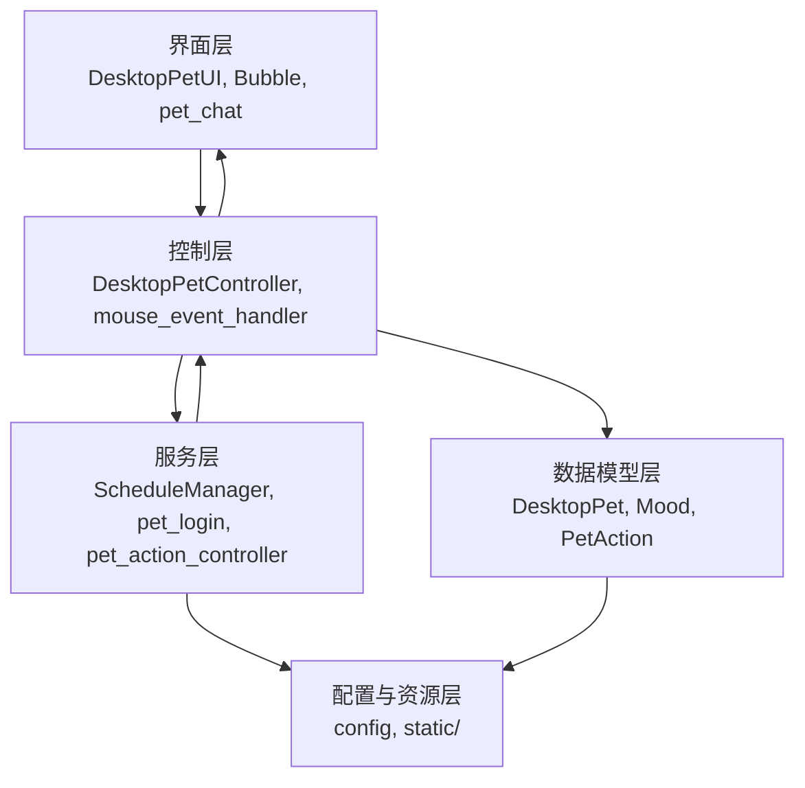
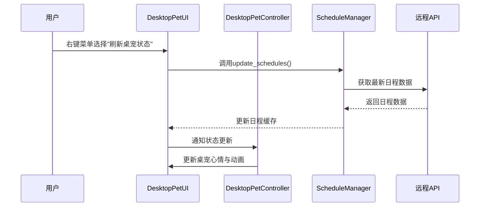

# 桌宠pet模块架构设计文档

## 2.1 架构图

- 本系统采用分层架构，核心分为：界面层（UI）、控制层（Controller）、数据模型层（Model）、工具与服务层（Service/Utils）、配置与资源层。
- 主要模块及数据流如下：

**示例描述：**
- 系统采用前端UI与控制器分离设计，UI层负责用户交互与展示，控制层负责业务逻辑与状态管理，数据模型层负责宠物状态与行为，服务层负责日程、登录等外部服务，配置层统一管理常量与资源路径。

## 2.2 架构风格

- **架构风格说明：**
  - 采用经典的分层架构（Layered Architecture），各层职责清晰，便于扩展和维护。
  - 事件驱动与消息传递机制用于UI与控制器、控制器与服务层之间的解耦。
- **关键决策：**
  - 采用单例模式管理ScheduleManager，保证全局唯一日程数据实例，提升一致性与性能。
  - 控制层与UI层解耦，便于后续支持多种前端界面。
  - 配置与资源集中管理，便于多环境部署和资源扩展。

**示例说明：**
- 选择分层架构的原因：
  - 优点：各层职责单一，便于团队协作和模块独立开发，易于测试和维护。
  - 缺点：层次过多时可能带来性能损耗，但本系统规模适中影响可控。
- 采用单例ScheduleManager的原因：
  - 优点：全局唯一实例，数据一致性高，节省内存。
  - 缺点：如需多用户并发需进一步隔离。

## 3. 关键设计决策

### 3.1 技术栈选型

| 组件     | 选型         | 理由                                   |
|----------|--------------|----------------------------------------|
| GUI      | PyQt5        | 跨平台、社区活跃、支持丰富UI控件        |
| 配置管理 | Python类+静态文件 | 统一管理常量、便于扩展和维护           |
| 数据存储 | 内存/文件/远程API | 轻量级，适合桌面端，支持远程同步        |
| 网络请求 | requests     | 简单易用，适合HTTP API交互              |

**写作建议：**
- 对比PyQt5与Tkinter等GUI技术，PyQt5更适合复杂交互和动画。
- 配置管理采用集中式，便于多环境切换。

### 3.2 核心模块设计

#### 1. DesktopPet（数据模型层）
- 负责桌宠的核心数据（位置、心情、动作、统计等），支持状态切换、动画路径计算。

#### 2. DesktopPetUI（界面层）
- 负责桌宠的界面渲染、动画播放、气泡消息、右键菜单等交互。
- 通过事件与Controller通信。

#### 3. DesktopPetController（控制层）
- 负责业务逻辑、状态管理、与UI和数据模型的交互。
- 管理桌宠的心情、动作、退出流程、待机动作等。

#### 4. ScheduleManager（服务层/工具类）
- 单例模式，负责日程数据的获取、缓存与同步。
- 支持手动刷新、自动同步、心情联动。

#### 5. 配置与资源（config/static）
- 统一管理所有常量、动画资源路径、UI参数等。

#### 6. 其他工具类
- mood、pet_action、pet_action_controller等，分别负责心情管理、动作管理、行为控制。

**核心流程交互（以"刷新桌宠状态"为例）：**

---

> 本文档为pet模块架构设计文档，后续可根据业务扩展微服务、数据库等架构。
